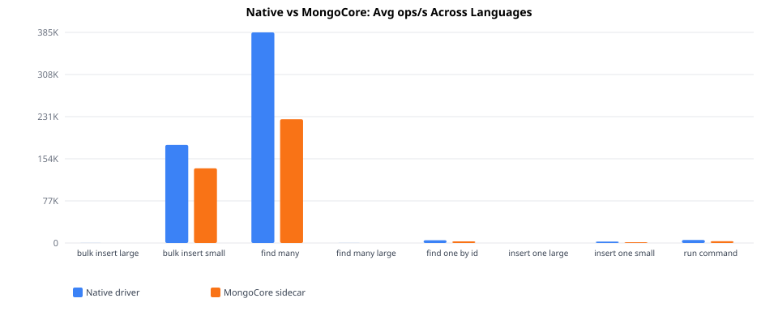
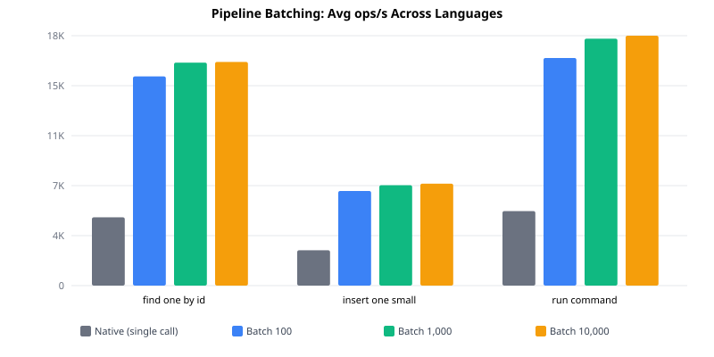
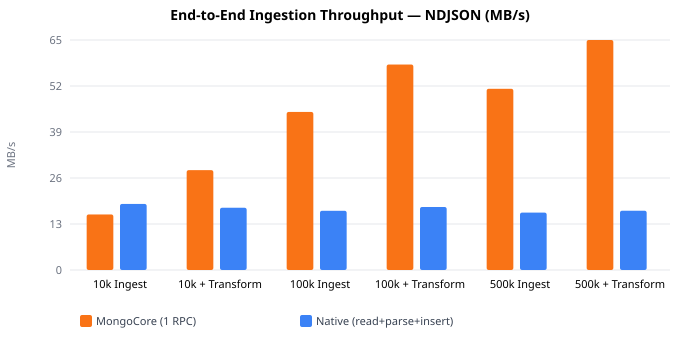

# Benchmark Results

Generated: 2026-05-14 19:17 UTC

## Driver Operations

| Operation | Python | TypeScript | Go | Java | Fastest Native | Overhead |
|-----------|-------:|-----------:|---:|-----:|---------------:|---------:|
| find_one_by_id | 2418 | 2682 | 3390 | 3430 | 5854 | +49% |
| insert_one_large | 39 | 38 | 38 | 31 | 46 | +21% |
| insert_one_small | 1286 | 1440 | 1499 | 1400 | 4288 | +67% |
| run_command | 2628 | 2933 | 3607 | 3849 | 6081 | +46% |
| bulk_insert_large | 42 | — | 42 | — | 50 | +15% |
| bulk_insert_small | 113.5K | 137.0K | 148.5K | 147.5K | 215.9K | +37% |
| find_many | 245.0K | 249.7K | 182.7K | 227.7K | 522.4K | +57% |
| find_many_large | 48 | — | 45 | — | 57 | +18% |

**Native:** Each driver connects directly to MongoDB and executes 10,000 operations per iteration. 
**MongoCore:** Same operations routed through the gRPC sidecar using each language's client library. 
**What this shows:** The pure sidecar overhead (gRPC serialization + proxy hop) on localhost with no network latency to amortize it — this is the worst case for MongoCore.

## Pipeline Batching

| Operation | Batch Size | Python | TypeScript | Go | Java | Fastest Native | Speedup |
|-----------|----------:|-------:|-----------:|---:|-----:|---------------:|--------:|
| find_one_by_id | 100 | 15.1K | 14.0K | 16.0K | 16.7K | 5854 | 2.6x |
| find_one_by_id | 1000 | 16.3K | 14.9K | 17.1K | 17.6K | 5854 | 2.8x |
| find_one_by_id | 10000 | 16.5K | 14.9K | 17.1K | 17.7K | 5854 | 2.8x |
| insert_one_small | 100 | 6797 | 7020 | 6943 | 7237 | 4288 | 1.6x |
| insert_one_small | 1000 | 7341 | 7476 | 7267 | 7620 | 4288 | 1.7x |
| insert_one_small | 10000 | 7449 | 7656 | 7368 | 7690 | 4288 | 1.8x |
| run_command | 100 | 16.3K | 15.7K | 17.7K | 17.7K | 6081 | 2.8x |
| run_command | 1000 | 17.9K | 16.8K | 18.8K | 19.6K | 6081 | 3.0x |
| run_command | 10000 | 18.2K | 16.8K | 19.2K | 19.7K | 6081 | 3.0x |

**Native:** Each operation is a separate round-trip to MongoDB (10,000 individual calls per iteration). 
**MongoCore:** N operations batched into a single gRPC call (e.g. batch 1000 = 10 calls of 1000 ops each). 
**What this shows:** The benefit of reducing round-trips — even with sidecar overhead, batching multiple operations into fewer network calls is significantly faster than individual calls.

## Ingestion

| Scenario | Format | Size | Native (MB/s) | MongoCore (MB/s) | Speedup |
|----------|--------|-----:|--------------:|-----------------:|--------:|
| ingest | csv | 10k | 11.20 | 17.79 | 1.6x |
| ingest | ndjson | 10k | 18.78 | 15.79 | 0.8x |
| ingest | csv | 100k | 13.49 | 32.05 | 2.4x |
| ingest | ndjson | 100k | 16.83 | 44.92 | 2.7x |
| ingest | csv | 500k | 13.27 | 40.62 | 3.1x |
| ingest | ndjson | 500k | 16.31 | 51.50 | 3.2x |
| ingest + transform | csv | 10k | 11.45 | 15.90 | 1.4x |
| ingest + transform | ndjson | 10k | 17.69 | 28.38 | 1.6x |
| ingest + transform | csv | 100k | 13.21 | 36.25 | 2.7x |
| ingest + transform | ndjson | 100k | 17.91 | 58.40 | 3.3x |
| ingest + transform | csv | 500k | 12.68 | 41.98 | 3.3x |
| ingest + transform | ndjson | 500k | 16.84 | 65.36 | 3.9x |

**Native:** Read file from disk, parse with Python's csv/json stdlib, apply transforms in a per-row loop, batch insert with 4 concurrent threads (pymongo). 
**MongoCore:** Single gRPC call triggers Polars (Rust) to read, parse, and apply vectorized transforms, then write with 4 concurrent async tasks. 
**What this shows:** At scale, Polars' columnar processing and Rust-native I/O outperform Python's per-row parsing and transformation — the gap widens with row count.

## Environment

- **OS:** darwin (arm64)
- **CPUs:** 12
- **MongoCore:** 0.6.0
