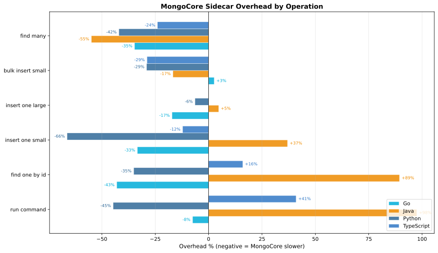
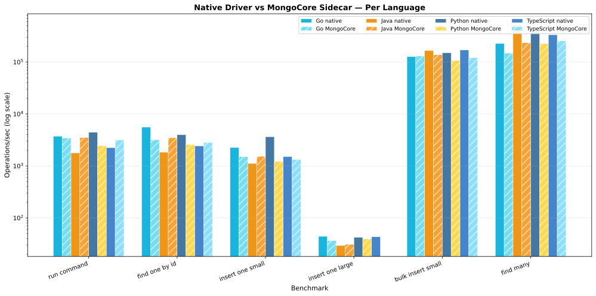
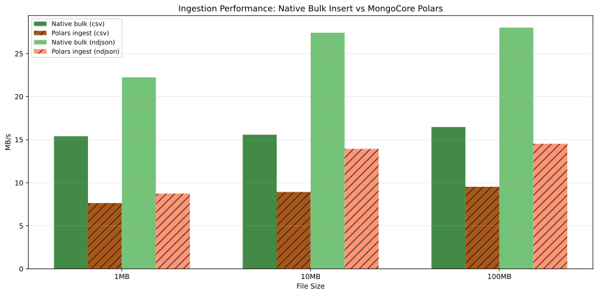

# MongoCore Benchmark Results

> **Auto-generated** — do not edit manually. Run `just bench-collect` to regenerate.

## Benchmark Environment

- **OS:** darwin (arm64)
- **CPUs:** 12
- **MongoDB:** Atlas Local Docker (localhost:27017)
- **MongoCore:** 0.6.0
- **Date:** 2026-05-12

> **Note:** All benchmarks run against `mongodb/mongodb-atlas-local` on localhost.
> This isolates MongoCore sidecar overhead without network latency noise.
> Production Atlas results will differ due to network, hardware, and cluster topology.
> These numbers measure the cost of the gRPC hop and MongoCore processing, not MongoDB performance.

### Caveats

These benchmarks provide a directional comparison, not absolute performance numbers:

1. **Uncontrolled environment.** Run on a developer workstation — no CPU scaling disabled, no core isolation, no background noise elimination.
2. **No tuning.** Neither native drivers nor MongoCore are tuned for optimal throughput (connection pools, batch sizes, write concerns are all defaults).
3. **Localhost only.** Network latency (the dominant cost in production) is absent. These numbers isolate sidecar overhead only.
4. **gRPC message limits.** MongoCore skips `bulk_insert_large` and `find_many_large` due to the default 4MB gRPC message limit.
5. **Single-client.** All benchmarks use a single connection. MongoCore's pooling and multiplexing benefits don't appear here.

## Go

### Throughput

| Operation | Native (ops/s) | MongoCore (ops/s) | Overhead | MB/s (native) | MB/s (MC) |
|-----------|---------------|-------------------|----------|---------------|-----------|
| run_command | 3,742 | 3,460 | -7.5% | 0.4 | 0.3 |
| find_one_by_id | 5,594 | 3,187 | -43.0% | 7.0 | 4.0 |
| insert_one_small | 2,270 | 1,512 | -33.4% | 0.4 | 0.3 |
| insert_one_large | 44 | 37 | -17.2% | 121.8 | 100.9 |
| bulk_insert_small | 126,965 | 130,340 | +2.7% | 22.3 | 22.9 |
| find_many | 227,047 | 148,296 | -34.7% | 40.0 | 26.1 |

### Latency (per operation)

| Operation | Native p50 | Native p95 | Native p99 | MC p50 | MC p95 | MC p99 |
|-----------|-----------|-----------|-----------|--------|--------|--------|
| run_command | 267us | 360us | 564us | 289us | 310us | 347us |
| find_one_by_id | 179us | 269us | 320us | 314us | 333us | 333us |
| insert_one_small | 441us | 1.08ms | 1.72ms | 661us | 782us | 782us |
| insert_one_large | 22.58ms | 28.64ms | 31.10ms | 27.26ms | 28.97ms | 29.98ms |
| bulk_insert_small | 8us | 8us | 10us | 8us | 9us | 19us |
| find_many | 4us | 5us | 6us | 7us | 8us | 8us |

## Java

### Throughput

| Operation | Native (ops/s) | MongoCore (ops/s) | Overhead | MB/s (native) | MB/s (MC) |
|-----------|---------------|-------------------|----------|---------------|-----------|
| run_command | 1,787 | 3,530 | +97.5% | 0.2 | 0.4 |
| find_one_by_id | 1,841 | 3,487 | +89.4% | 2.3 | 4.3 |
| insert_one_small | 1,117 | 1,530 | +37.0% | 0.2 | 0.3 |
| insert_one_large | 30 | 31 | +4.7% | 81.4 | 85.2 |
| bulk_insert_small | 165,630 | 137,950 | -16.7% | 29.2 | 24.3 |
| find_many | 520,052 | 234,512 | -54.9% | 91.5 | 41.3 |

### Latency (per operation)

| Operation | Native p50 | Native p95 | Native p99 | MC p50 | MC p95 | MC p99 |
|-----------|-----------|-----------|-----------|--------|--------|--------|
| run_command | 560us | 698us | 6.26ms | 283us | 291us | 291us |
| find_one_by_id | 543us | 788us | 873us | 287us | 300us | 302us |
| insert_one_small | 895us | 2.18ms | 2.57ms | 653us | 679us | 679us |
| insert_one_large | 33.79ms | 37.17ms | 40.13ms | 32.29ms | 34.89ms | 37.69ms |
| bulk_insert_small | 6us | 7us | 8us | 7us | 8us | 9us |
| find_many | 2us | 2us | 2us | 4us | 5us | 5us |

## Python

### Throughput

| Operation | Native (ops/s) | MongoCore (ops/s) | Overhead | MB/s (native) | MB/s (MC) |
|-----------|---------------|-------------------|----------|---------------|-----------|
| run_command | 4,438 | 2,453 | -44.7% | 0.4 | 0.2 |
| find_one_by_id | 3,983 | 2,585 | -35.1% | 5.1 | 3.3 |
| insert_one_small | 3,651 | 1,230 | -66.3% | 0.8 | 0.3 |
| insert_one_large | 42 | 40 | -6.4% | 116.3 | 108.8 |
| bulk_insert_small | 150,799 | 106,943 | -29.1% | 31.8 | 22.6 |
| bulk_insert_large | 47 | *SKIPPED* | — | 130.3 | — |
| find_many | 389,796 | 225,861 | -42.1% | 82.2 | 47.7 |
| find_many_large | 56 | *SKIPPED* | — | 155.1 | — |

### Latency (per operation)

| Operation | Native p50 | Native p95 | Native p99 | MC p50 | MC p95 | MC p99 |
|-----------|-----------|-----------|-----------|--------|--------|--------|
| run_command | 225us | 254us | 280us | 408us | 452us | 452us |
| find_one_by_id | 251us | 277us | 284us | 387us | 396us | 396us |
| insert_one_small | 274us | 312us | 337us | 813us | 824us | 824us |
| insert_one_large | 23.65ms | 28.45ms | 30.93ms | 25.27ms | 26.36ms | 29.00ms |
| bulk_insert_small | 7us | 8us | 8us | 9us | 10us | 14us |
| bulk_insert_large | 21.10ms | 22.50ms | 25.56ms | — | — | — |
| find_many | 3us | 3us | 3us | 4us | 5us | 6us |
| find_many_large | 17.74ms | 18.41ms | 19.59ms | — | — | — |

## TypeScript

### Throughput

| Operation | Native (ops/s) | MongoCore (ops/s) | Overhead | MB/s (native) | MB/s (MC) |
|-----------|---------------|-------------------|----------|---------------|-----------|
| run_command | 2,246 | 3,167 | +41.0% | 0.2 | 0.3 |
| find_one_by_id | 2,428 | 2,817 | +16.0% | 2.8 | 3.3 |
| insert_one_small | 1,520 | 1,335 | -12.2% | 0.3 | 0.2 |
| insert_one_large | 43 | *SKIPPED* | — | 119.4 | — |
| bulk_insert_small | 170,128 | 120,995 | -28.9% | 28.4 | 20.2 |
| find_many | 334,854 | 254,657 | -23.9% | 55.9 | 42.5 |

### Latency (per operation)

| Operation | Native p50 | Native p95 | Native p99 | MC p50 | MC p95 | MC p99 |
|-----------|-----------|-----------|-----------|--------|--------|--------|
| run_command | 445us | 1.02ms | 2.27ms | 316us | 328us | 328us |
| find_one_by_id | 412us | 554us | 619us | 355us | 461us | 461us |
| insert_one_small | 658us | 1.90ms | 2.16ms | 749us | 766us | 766us |
| insert_one_large | 23.03ms | 27.20ms | 32.57ms | — | — | — |
| bulk_insert_small | 6us | 7us | 7us | 8us | 9us | 10us |
| find_many | 3us | 3us | 3us | 4us | 4us | 6us |

## Overhead Summary

## Throughput Comparison (All Languages)

## Ingestion Performance (MB/s)

Comparing MongoCore Polars ingestion pipeline vs native pymongo bulk insert.

| File Size | Format | Native Bulk (MB/s) | Polars Ingest (MB/s) | Speedup |
|-----------|--------|-------------------|---------------------|---------|
| 1MB | csv | 15.4 | 7.6 | 0.50x |
| 1MB | ndjson | 22.2 | 8.7 | 0.39x |
| 10MB | csv | 15.6 | 8.9 | 0.57x |
| 10MB | ndjson | 27.4 | 13.9 | 0.51x |
| 100MB | csv | 16.5 | 9.5 | 0.58x |
| 100MB | ndjson | 28.0 | 14.5 | 0.52x |

