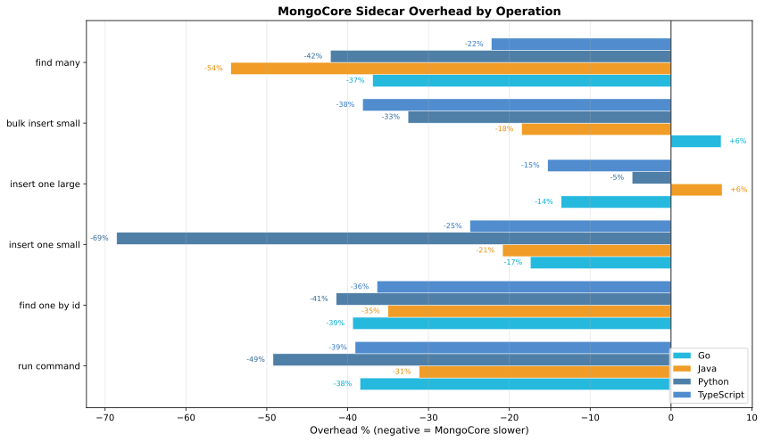
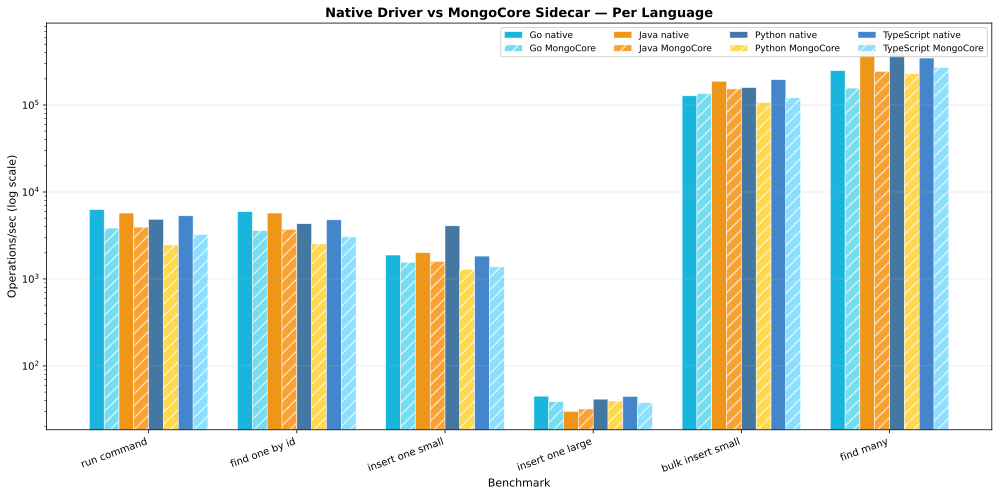

# MongoCore Benchmark Results

> **Auto-generated** — do not edit manually. Run `just bench-collect` to regenerate.

## Benchmark Environment

- **OS:** darwin (arm64)
- **CPUs:** 12
- **MongoDB:** Atlas Local Docker (localhost:27017)
- **MongoCore:** 0.6.0
- **Date:** 2026-05-13

> **Note:** All benchmarks run against `mongodb/mongodb-atlas-local` on localhost.
> This isolates MongoCore sidecar overhead without network latency noise.
> Production Atlas results will differ due to network, hardware, and cluster topology.
> These numbers measure the cost of the gRPC hop and MongoCore processing, not MongoDB performance.

### Caveats

These benchmarks provide a directional comparison, not absolute performance numbers:

1. **Uncontrolled environment.** Run on a developer workstation — no CPU scaling disabled, no core isolation, no background noise elimination.
2. **No tuning.** Neither native drivers nor MongoCore are tuned for optimal throughput (connection pools, batch sizes, write concerns are all defaults).
3. **Localhost only.** Network latency (the dominant cost in production) is absent. These numbers isolate sidecar overhead only.
4. **gRPC message limits.** MongoCore skips `bulk_insert_large` and `find_many_large` due to the default 4MB gRPC message limit.
5. **Single-client.** All benchmarks use a single connection. MongoCore's pooling and multiplexing benefits don't appear here.

## Go

### Throughput

| Operation | Native (ops/s) | MongoCore (ops/s) | Overhead | MB/s (native) | MB/s (MC) |
|-----------|---------------|-------------------|----------|---------------|-----------|
| run_command | 6,256 | 3,849 | -38.5% | 0.6 | 0.4 |
| find_one_by_id | 5,937 | 3,599 | -39.4% | 7.4 | 4.5 |
| insert_one_small | 1,884 | 1,556 | -17.4% | 0.3 | 0.3 |
| insert_one_large | 45 | 39 | -13.6% | 123.4 | 106.6 |
| bulk_insert_small | 127,498 | 135,394 | +6.2% | 22.4 | 23.8 |
| find_many | 248,228 | 156,644 | -36.9% | 43.7 | 27.6 |

### Latency (per operation)

| Operation | Native p50 | Native p95 | Native p99 | MC p50 | MC p95 | MC p99 |
|-----------|-----------|-----------|-----------|--------|--------|--------|
| run_command | 160us | 165us | 165us | 260us | 262us | 265us |
| find_one_by_id | 168us | 177us | 191us | 278us | 282us | 287us |
| insert_one_small | 531us | 538us | 538us | 643us | 948us | 948us |
| insert_one_large | 22.28ms | 24.24ms | 25.22ms | 25.80ms | 27.39ms | 29.79ms |
| bulk_insert_small | 8us | 9us | 9us | 7us | 8us | 12us |
| find_many | 4us | 4us | 4us | 6us | 7us | 7us |

## Java

### Throughput

| Operation | Native (ops/s) | MongoCore (ops/s) | Overhead | MB/s (native) | MB/s (MC) |
|-----------|---------------|-------------------|----------|---------------|-----------|
| run_command | 5,728 | 3,944 | -31.1% | 0.6 | 0.4 |
| find_one_by_id | 5,730 | 3,724 | -35.0% | 7.1 | 4.6 |
| insert_one_small | 2,005 | 1,588 | -20.8% | 0.4 | 0.3 |
| insert_one_large | 30 | 32 | +6.3% | 82.8 | 87.9 |
| bulk_insert_small | 187,772 | 153,080 | -18.5% | 33.0 | 26.9 |
| find_many | 536,519 | 244,465 | -54.4% | 94.4 | 43.0 |

### Latency (per operation)

| Operation | Native p50 | Native p95 | Native p99 | MC p50 | MC p95 | MC p99 |
|-----------|-----------|-----------|-----------|--------|--------|--------|
| run_command | 175us | 183us | 185us | 254us | 266us | 271us |
| find_one_by_id | 175us | 193us | 193us | 269us | 276us | 276us |
| insert_one_small | 499us | 518us | 518us | 630us | 647us | 647us |
| insert_one_large | 33.22ms | 35.18ms | 38.10ms | 31.28ms | 32.80ms | 36.61ms |
| bulk_insert_small | 5us | 6us | 7us | 7us | 7us | 7us |
| find_many | 2us | 2us | 2us | 4us | 4us | 5us |

## Python

### Throughput

| Operation | Native (ops/s) | MongoCore (ops/s) | Overhead | MB/s (native) | MB/s (MC) |
|-----------|---------------|-------------------|----------|---------------|-----------|
| run_command | 4,854 | 2,464 | -49.2% | 0.5 | 0.2 |
| find_one_by_id | 4,313 | 2,527 | -41.4% | 5.4 | 3.2 |
| insert_one_small | 4,082 | 1,283 | -68.6% | 0.7 | 0.2 |
| insert_one_large | 42 | 40 | -4.8% | 114.1 | 108.7 |
| bulk_insert_small | 158,694 | 107,066 | -32.5% | 27.9 | 18.8 |
| bulk_insert_large | 48 | *SKIPPED* | — | 131.1 | — |
| find_many | 395,564 | 228,921 | -42.1% | 69.6 | 40.3 |
| find_many_large | 57 | *SKIPPED* | — | 156.9 | — |

### Latency (per operation)

| Operation | Native p50 | Native p95 | Native p99 | MC p50 | MC p95 | MC p99 |
|-----------|-----------|-----------|-----------|--------|--------|--------|
| run_command | 206us | 214us | 215us | 406us | 438us | 438us |
| find_one_by_id | 232us | 241us | 242us | 396us | 403us | 403us |
| insert_one_small | 245us | 254us | 258us | 779us | 783us | 783us |
| insert_one_large | 24.10ms | 27.31ms | 28.30ms | 25.30ms | 26.63ms | 28.44ms |
| bulk_insert_small | 6us | 7us | 9us | 9us | 10us | 12us |
| bulk_insert_large | 20.98ms | 28.42ms | 32.22ms | — | — | — |
| find_many | 3us | 3us | 3us | 4us | 5us | 5us |
| find_many_large | 17.53ms | 18.25ms | 19.68ms | — | — | — |

## TypeScript

### Throughput

| Operation | Native (ops/s) | MongoCore (ops/s) | Overhead | MB/s (native) | MB/s (MC) |
|-----------|---------------|-------------------|----------|---------------|-----------|
| run_command | 5,321 | 3,242 | -39.1% | 0.5 | 0.3 |
| find_one_by_id | 4,780 | 3,042 | -36.4% | 5.6 | 3.5 |
| insert_one_small | 1,832 | 1,376 | -24.9% | 0.3 | 0.2 |
| insert_one_large | 45 | 38 | -15.2% | 122.8 | 103.9 |
| bulk_insert_small | 195,472 | 120,904 | -38.1% | 32.6 | 20.2 |
| find_many | 346,792 | 269,752 | -22.2% | 57.9 | 45.0 |

### Latency (per operation)

| Operation | Native p50 | Native p95 | Native p99 | MC p50 | MC p95 | MC p99 |
|-----------|-----------|-----------|-----------|--------|--------|--------|
| run_command | 188us | 198us | 208us | 308us | 315us | 315us |
| find_one_by_id | 209us | 219us | 222us | 329us | 336us | 336us |
| insert_one_small | 546us | 563us | 563us | 727us | 753us | 753us |
| insert_one_large | 22.40ms | 23.76ms | 25.54ms | 26.47ms | 30.44ms | 32.30ms |
| bulk_insert_small | 5us | 6us | 6us | 8us | 10us | 13us |
| find_many | 3us | 3us | 4us | 4us | 4us | 5us |

## Overhead Summary

## Throughput Comparison (All Languages)

