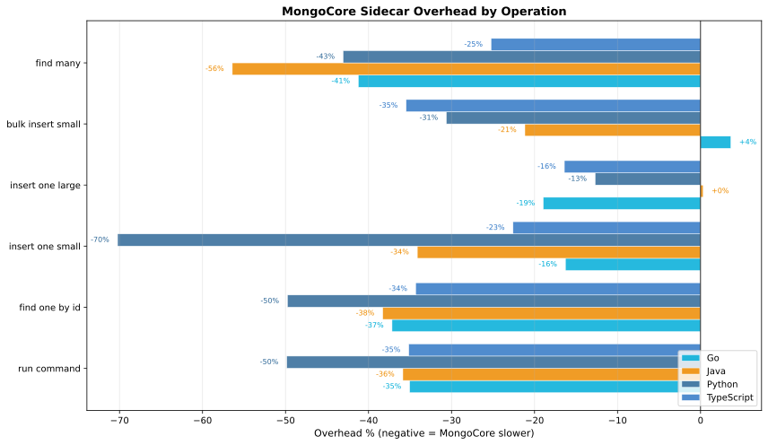
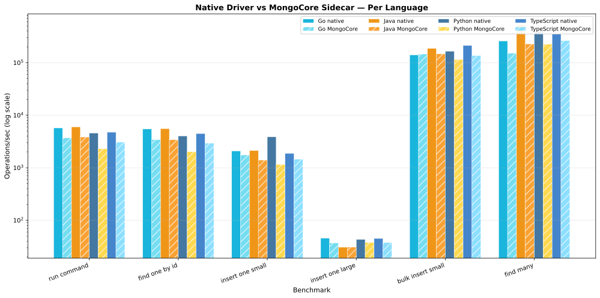
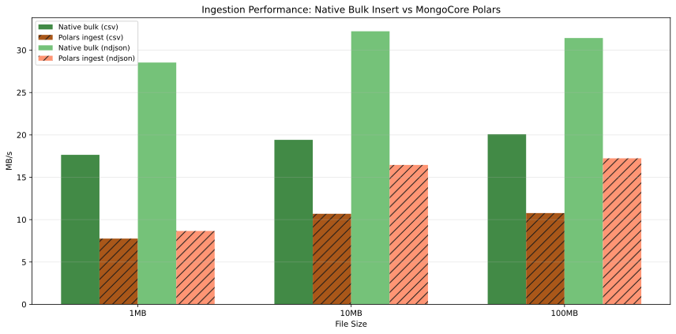

# MongoCore Benchmark Results

> **Auto-generated** — do not edit manually. Run `just bench-collect` to regenerate.

## Benchmark Environment

- **OS:** darwin (arm64)
- **CPUs:** 12
- **MongoDB:** Atlas Local Docker (localhost:27017)
- **MongoCore:** 0.6.0
- **Date:** 2026-05-13

> **Note:** All benchmarks run against `mongodb/mongodb-atlas-local` on localhost.
> This isolates MongoCore sidecar overhead without network latency noise.
> Production Atlas results will differ due to network, hardware, and cluster topology.
> These numbers measure the cost of the gRPC hop and MongoCore processing, not MongoDB performance.

### Caveats

These benchmarks provide a directional comparison, not absolute performance numbers:

1. **Uncontrolled environment.** Run on a developer workstation — no CPU scaling disabled, no core isolation, no background noise elimination.
2. **No tuning.** Neither native drivers nor MongoCore are tuned for optimal throughput (connection pools, batch sizes, write concerns are all defaults).
3. **Localhost only.** Network latency (the dominant cost in production) is absent. These numbers isolate sidecar overhead only.
4. **gRPC message limits.** MongoCore skips `bulk_insert_large` and `find_many_large` due to the default 4MB gRPC message limit.
5. **Single-client.** All benchmarks use a single connection. MongoCore's pooling and multiplexing benefits don't appear here.

## Go

### Throughput

| Operation | Native (ops/s) | MongoCore (ops/s) | Overhead | MB/s (native) | MB/s (MC) |
|-----------|---------------|-------------------|----------|---------------|-----------|
| run_command | 5,726 | 3,719 | -35.1% | 0.6 | 0.4 |
| find_one_by_id | 5,462 | 3,431 | -37.2% | 6.8 | 4.3 |
| insert_one_small | 2,093 | 1,752 | -16.3% | 0.4 | 0.3 |
| insert_one_large | 46 | 37 | -19.0% | 126.2 | 102.2 |
| bulk_insert_small | 140,826 | 145,972 | +3.7% | 24.8 | 25.7 |
| find_many | 259,145 | 152,289 | -41.2% | 45.6 | 26.8 |

### Latency (per operation)

| Operation | Native p50 | Native p95 | Native p99 | MC p50 | MC p95 | MC p99 |
|-----------|-----------|-----------|-----------|--------|--------|--------|
| run_command | 175us | 185us | 188us | 269us | 278us | 288us |
| find_one_by_id | 183us | 194us | 194us | 291us | 301us | 304us |
| insert_one_small | 478us | 497us | 497us | 571us | 592us | 592us |
| insert_one_large | 21.79ms | 26.82ms | 39.45ms | 26.92ms | 28.78ms | 32.41ms |
| bulk_insert_small | 7us | 8us | 11us | 7us | 7us | 13us |
| find_many | 4us | 4us | 4us | 7us | 7us | 8us |

## Java

### Throughput

| Operation | Native (ops/s) | MongoCore (ops/s) | Overhead | MB/s (native) | MB/s (MC) |
|-----------|---------------|-------------------|----------|---------------|-----------|
| run_command | 6,002 | 3,849 | -35.9% | 0.6 | 0.4 |
| find_one_by_id | 5,558 | 3,430 | -38.3% | 6.9 | 4.3 |
| insert_one_small | 2,125 | 1,400 | -34.1% | 0.4 | 0.2 |
| insert_one_large | 31 | 31 | +0.3% | 85.0 | 85.2 |
| bulk_insert_small | 187,097 | 147,493 | -21.2% | 32.9 | 26.0 |
| find_many | 522,414 | 227,689 | -56.4% | 91.9 | 40.1 |

### Latency (per operation)

| Operation | Native p50 | Native p95 | Native p99 | MC p50 | MC p95 | MC p99 |
|-----------|-----------|-----------|-----------|--------|--------|--------|
| run_command | 167us | 175us | 180us | 260us | 272us | 274us |
| find_one_by_id | 180us | 187us | 190us | 292us | 299us | 302us |
| insert_one_small | 471us | 508us | 508us | 714us | 740us | 740us |
| insert_one_large | 32.35ms | 34.18ms | 40.08ms | 32.28ms | 36.68ms | 40.38ms |
| bulk_insert_small | 5us | 6us | 7us | 7us | 8us | 9us |
| find_many | 2us | 2us | 2us | 4us | 5us | 5us |

## Python

### Throughput

| Operation | Native (ops/s) | MongoCore (ops/s) | Overhead | MB/s (native) | MB/s (MC) |
|-----------|---------------|-------------------|----------|---------------|-----------|
| run_command | 4,573 | 2,293 | -49.9% | 0.5 | 0.2 |
| find_one_by_id | 4,034 | 2,026 | -49.8% | 5.0 | 2.5 |
| insert_one_small | 3,873 | 1,153 | -70.2% | 0.7 | 0.2 |
| insert_one_large | 43 | 38 | -12.7% | 118.9 | 103.9 |
| bulk_insert_small | 165,574 | 114,859 | -30.6% | 29.1 | 20.2 |
| bulk_insert_large | 47 | *SKIPPED* | — | 129.6 | — |
| find_many | 395,684 | 225,272 | -43.1% | 69.6 | 39.6 |
| find_many_large | 56 | *SKIPPED* | — | 154.1 | — |

### Latency (per operation)

| Operation | Native p50 | Native p95 | Native p99 | MC p50 | MC p95 | MC p99 |
|-----------|-----------|-----------|-----------|--------|--------|--------|
| run_command | 219us | 227us | 228us | 436us | 478us | 478us |
| find_one_by_id | 248us | 257us | 262us | 494us | 538us | 538us |
| insert_one_small | 258us | 274us | 281us | 868us | 926us | 926us |
| insert_one_large | 23.12ms | 27.71ms | 29.08ms | 26.47ms | 27.71ms | 28.60ms |
| bulk_insert_small | 6us | 7us | 7us | 9us | 9us | 9us |
| bulk_insert_large | 21.22ms | 21.88ms | 22.56ms | — | — | — |
| find_many | 3us | 3us | 3us | 4us | 5us | 5us |
| find_many_large | 17.84ms | 18.23ms | 18.66ms | — | — | — |

## TypeScript

### Throughput

| Operation | Native (ops/s) | MongoCore (ops/s) | Overhead | MB/s (native) | MB/s (MC) |
|-----------|---------------|-------------------|----------|---------------|-----------|
| run_command | 4,753 | 3,082 | -35.2% | 0.5 | 0.3 |
| find_one_by_id | 4,488 | 2,948 | -34.3% | 5.2 | 3.4 |
| insert_one_small | 1,882 | 1,457 | -22.6% | 0.3 | 0.2 |
| insert_one_large | 45 | 38 | -16.4% | 124.0 | 103.8 |
| bulk_insert_small | 212,198 | 136,921 | -35.5% | 35.4 | 22.9 |
| find_many | 351,770 | 262,973 | -25.2% | 58.7 | 43.9 |

### Latency (per operation)

| Operation | Native p50 | Native p95 | Native p99 | MC p50 | MC p95 | MC p99 |
|-----------|-----------|-----------|-----------|--------|--------|--------|
| run_command | 210us | 218us | 218us | 324us | 332us | 332us |
| find_one_by_id | 223us | 235us | 236us | 339us | 355us | 355us |
| insert_one_small | 531us | 550us | 550us | 686us | 705us | 705us |
| insert_one_large | 22.18ms | 23.77ms | 24.97ms | 26.50ms | 29.64ms | 31.36ms |
| bulk_insert_small | 5us | 5us | 6us | 7us | 9us | 10us |
| find_many | 3us | 3us | 3us | 4us | 4us | 4us |

## Overhead Summary

## Throughput Comparison (All Languages)

## Ingestion Performance (MB/s)

Comparing MongoCore Polars ingestion pipeline vs native pymongo bulk insert.

| File Size | Format | Native Bulk (MB/s) | Polars Ingest (MB/s) | Speedup |
|-----------|--------|-------------------|---------------------|---------|
| 1MB | csv | 17.6 | 7.8 | 0.44x |
| 1MB | ndjson | 28.5 | 8.7 | 0.30x |
| 10MB | csv | 19.4 | 10.7 | 0.55x |
| 10MB | ndjson | 32.2 | 16.5 | 0.51x |
| 100MB | csv | 20.1 | 10.8 | 0.54x |
| 100MB | ndjson | 31.4 | 17.2 | 0.55x |

